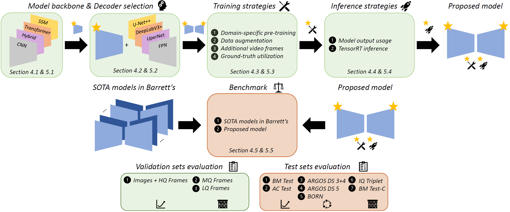

<div align="center">
<h1>Publication</h1>
<h3>Designing a Computer-Aided Detection system for Barrett's neoplasia: Insights in architectural choices, training strategies and inference approaches</h3>

[Carolus H.J. Kusters](https://chjkusters.github.io/)<sup>1 :email:</sup>, [Tim G.W. Boers](https://scholar.google.nl/citations?user=_TdckGAAAAAJ&hl=nl&oi=ao)<sup>1</sup>, [Tim J.M. Jaspers](https://scholar.google.nl/citations?user=nwfiV2wAAAAJ&hl=nl&oi=ao)<sup>1</sup>, [Martijn R. Jong](https://scholar.google.nl/citations?user=QRNrL-oAAAAJ&hl=nl&oi=ao)<sup>2</sup>, Rixta A.H. van Eijck van Heslinga<sup>2</sup>, Jelmer B. Jukema<sup>2</sup>, Kiki N. Fockens<sup>2</sup>, Albert J. de Groof<sup>2</sup>, [Jacques J. Bergman](https://scholar.google.nl/citations?user=4SFBE0IAAAAJ&hl=nl&oi=ao)<sup>2</sup>, [Fons van der Sommen](https://scholar.google.nl/citations?user=qFiLkCAAAAAJ&hl=nl&oi=ao)<sup>1</sup>, Peter H.N. de With<sup>1</sup> 

<sup>1</sup>  Department of Electrical Engineering, Video Coding & Architectures, Eindhoven University of Technology <br /> <sup>2</sup>  Department of Gastroenterology and Hepatology, Amsterdam University Medical Centers, University of Amsterdam

(<sup>:email:</sup>) corresponding author

*Submission under Review*

</div>

## Abstract
**Background and Objective**: Detecting early neoplasia in Barrett’s Esophagus (BE) presents significant challenges due to the
subtle endoscopic appearance of lesions. Computer-Aided Detection (CADe) systems have the potential to assist endoscopists by
enhancing the identification and localization of these early-stage lesions. This study aims to provide comprehensive insights into
the structured design and development of effective CADe systems for BE neoplasia detection, addressing unique challenges and
complexities of endoscopic imaging and the nature of BE neoplasia. 

**Methods**: We conducted an extensive evaluation of architectural choices, training strategies, and inference approaches to optimize
CADe systems for BE neoplasia detection. This evaluation included 10 backbone architectures and 4 semantic segmentation
decoders. Training strategies assessed were domain-specific pre-training with a self-supervised learning objective, data augmen-
tation techniques, incorporation of additional video frames and utilization of variants for multi-expert segmentation ground-truth.
Evaluation of inference approaches included various model output fusion techniques and TensorRT conversion. The optimized
model was benchmarked against 6 state-of-the-art CADe systems for BE neoplasia detection across 9 diverse test sets.

**Results**: The experimental results demonstrate the impact of incorporating structured design considerations, leading to measurable
and incremental performance gains of up to 7.8% on dedicated validation sets. The model optimized through these design choices
achieves statistically significant improvements over existing CADe systems, with p-values in the range p ∈ [0.0019, 0.031]. It
outperforms state-of-the-art models in classification and localization, with improvements of up to 12.8% over the second-best
performing model. These gains demonstrate enhanced peak performance, generalization capabilities, and robustness across diverse
test sets representative of real-world clinical challenges.

**Conclusion**: This study provides critical insights into the structured development of effective CADe systems for Barrett’s
neoplasia detection. By addressing the specific challenges associated with endoscopic imaging and Barrett’s neoplasia, the study
demonstrates that careful consideration of architectural choices, training strategies, and inference approaches results in significantly
improved CADe performance. These findings underscore the importance of tailored design and optimization in developing robust
and clinically effective CADe systems.

## Infographic
A graphical representation of the experimental setup in the study.


## Folder Structure
The folder structure of this repository is as follows:

```bash
├── cache
│   └── ...
├── data
│   └── dataset.py
│   └── dataset_cls.py
│   └── domain_augmentations.py
│   └── domain_augmentations_cls.py
├── models
│   ├── Abdelrahim.py
│   └── ...
│   └── VisionMamba.py
├── preprocess
│   └── generate_cache.py
├── pretrained
│   └── ...
├── utils
│   ├── loss.py
│   ├── metrics.py
│   └── optim.py
├── inference.py
├── inference_cls.py
├── inference_cls_mamba.py
├── inference_trt.py
├── train.py
├── train_cls.py
├── train_cls_mamba.py
└── README.md
```

## Environment
The required docker image for a SLURM cluster with apptainer is specified in "train.sh" (Regular models).
The required docker image for a SLURM cluster with apptainer is specified in "train_mamba.sh" (Vision Mamba model).
The conda environment with the software dependencies for this project are specified in "conda.yaml".

## Pretrained models
The ImageNet pretrained weights are downloaded from the following links and put under the "pretrained" folder: ...
- PvTv2: https://github.com/whai362/PVT/tree/v2/classification
- SwinV2: https://github.com/microsoft/Swin-Transformer
- UniFormer: https://github.com/Sense-X/UniFormer/tree/main/image_classification
- VisionMamba: https://github.com/hustvl/Vim/tree/main

## Citation
if you think this helsp please use the following citation for the journal article:
```bash